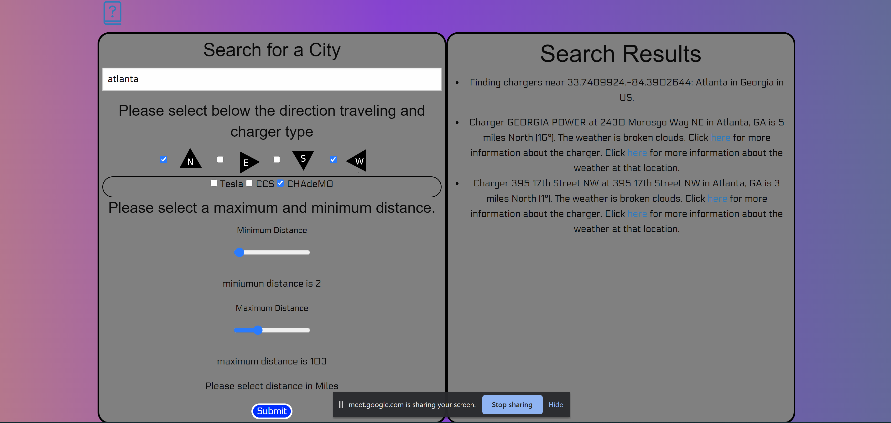

# Find_Dry_Chargers 

Imagine that you are a driver of an electric
vehicle going on a long trip.  You need to
stop and charge your battery every 100
miles or so.  However, the chargers are
not covered, so if it is raining you will
get wet when you connect the charging cable,
and you will risk water getting into the
charge port and damaging the electronics.

Therefore, you would like to stop at chargers
at which it is not raining,
This application satisfies that need
by telling you the weather at several
chargers and letting you choose which
to stop at.

We use these technologies: JavaScript,
jQuery, the Foundation framework and the
Crypto package.

The application is on GitHub at this URL:
https://github.com/Jay3172/Find_Dry_Chargers
and is deployed at this URL:
https://jay3172.github.io/Find_Dry_Chargers/.

Here is a screen shot showing CHAdeMO chargers
North and West of Atlanta, but not in the city itself.

